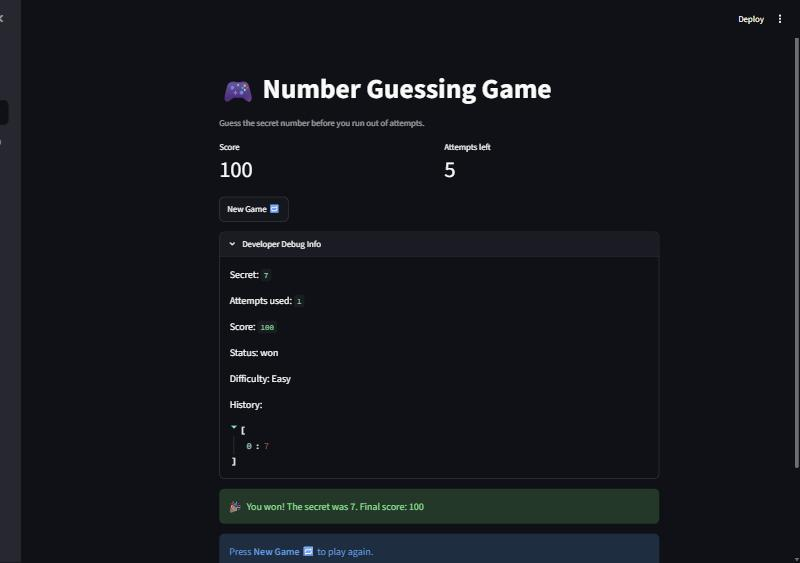

# 🎮 Game Glitch Investigator: The Impossible Guesser

## 🚨 The Situation

An AI was asked to build a simple "Number Guessing Game" using Streamlit. It
wrote the code, ran away, and left behind a game that could not be played:
the hints pointed the wrong way, the score moved in the wrong direction, and
once a round ended there was no way to start another one.

This repo contains the investigation and the repair.

## 🛠️ Setup

```bash
pip install -r requirements.txt
```

```bash
python -m streamlit run app.py
```

Run the tests with:

```bash
python -m pytest tests/ -q
```

## 🎯 What the game does

Pick a difficulty, and the app draws a secret whole number from that
difficulty's range. You type guesses; after each one the game tells you
whether the secret is higher or lower, and tracks how many attempts you have
left. Win before the attempts run out and you score points — the faster the
win, the higher the score. Wrong guesses cost 5 points each.

| Difficulty | Range | Attempts | Minimum guesses needed (binary search) |
|---|---|---|---|
| Easy | 1–20 | 6 | 5 |
| Normal | 1–100 | 8 | 7 |
| Hard | 1–200 | 10 | 8 |

## 🐛 Bugs found

Every bug below was reproduced before it was fixed.

### 1. The hints were inverted (`check_guess`)

```python
if guess > secret:
    return "Too High", "📈 Go HIGHER!"   # guess is already too high
```

The outcome label was right and the message was its exact opposite, so
following the hint walked you away from the answer.

### 2. The secret changed type on alternating turns (`app.py`)

```python
if st.session_state.attempts % 2 == 0:
    secret = str(st.session_state.secret)   # now a string
```

Comparing `int > str` raises `TypeError`, and `check_guess` swallowed it in a
bare `except` that re-compared both values **as text**. String comparison is
lexicographic, so with a secret of 50:

| Guess | Truth | Game said |
|---|---|---|
| 9 | too low | **"Too High"** (`"9" > "50"`) |
| 100 | too high | **"Too Low"** (`"100" < "50"`) |

This is why the secret seemed to "change its mind" every other turn. It never
changed — the comparison did.

### 3. "New Game" could not start a new game (`app.py`)

```python
if new_game:
    st.session_state.attempts = 0
    st.session_state.secret = random.randint(1, 100)
    st.rerun()
```

It reset `attempts` and `secret` but not `status`, `score` or `history`. Once
`status` became `"won"` or `"lost"`, the `st.stop()` guard below it fired on
every rerun forever. The only escape was restarting the server.

It also always drew from 1–100, ignoring the selected difficulty — on Easy
(1–20) that produced a secret outside the range the UI promised.

### 4. Scoring was arbitrary (`update_score`)

- `attempts` was initialised to `1` and incremented *before* scoring, so a
  perfect first-guess win was scored as attempt 2 and paid **70** instead of 100.
- `"Too High"` guesses **added** 5 points on even attempts and subtracted 5 on
  odd ones, while `"Too Low"` always subtracted. Identical mistakes scored
  differently depending on which turn you made them.
- Nothing stopped the score going negative.

### 5. Invalid input burned a turn (`app.py`)

`st.session_state.attempts += 1` ran before parsing, so a typo cost an attempt.
The loss check lived only in the valid-guess branch, so a run of typos could
push `attempts` past the limit without ever ending the game.

### 6. `parse_guess` silently truncated decimals and ignored the range

`"5.9"` became `5` with no warning, and `99999` was accepted as a guess on a
1–20 board.

### 7. The UI lied about the board

`"Guess a number between 1 and 100"` was hardcoded regardless of difficulty,
and "Attempts left" was off by one because the counter started at 1.

### 8. Hard was easier than Normal

`get_range_for_difficulty` returned 1–50 for Hard and 1–100 for Normal, while
Hard also gave the fewest attempts.

### 9. The logic was never extracted, so the tests could not pass

`logic_utils.py` was four `NotImplementedError` stubs while `app.py` kept its
own private copies of the same functions. All three starter tests errored out.
The starter tests also expected `check_guess` to return a bare outcome string,
but `app.py`'s version returned an `(outcome, message)` tuple.

## 🔧 Fixes applied

- **Logic extracted** into `logic_utils.py` with no Streamlit import, so it is
  testable in isolation. `app.py` now imports it instead of duplicating it.
- **`check_guess` returns just the outcome string**, matching the contract the
  starter tests already specified. The player-facing wording moved to a
  separate `hint_for(outcome)` lookup — comparison and copywriting are now
  separate concerns, so a reworded hint cannot break the comparison.
- **Hints corrected**: "Too High" now says *go LOWER*.
- **The secret stays an `int`.** The stringify branch is gone, and
  `check_guess` coerces both arguments with `int()` so the lexicographic path
  cannot come back. The bare `except TypeError` that hid the bug was deleted.
- **`start_new_round()`** resets *all* round state — secret, attempts, status,
  history and score — and draws from the currently selected difficulty's range.
  Changing difficulty mid-game also starts a clean round.
- **Scoring made monotonic**: a win pays `100 - 10 × (attempts - 1)` with a
  floor of 10, every wrong guess costs a flat 5, and the score is clamped at 0.
- **Attempts only increment on a valid guess**, and the loss check runs after
  any valid guess.
- **`parse_guess` rejects** decimals (with a distinct message), non-numbers and
  out-of-range values instead of coercing them.
- **UI reads from state**: the range, attempts-left counter and sidebar all
  derive from the selected difficulty.
- **Hard is now 1–200 with 10 attempts**, genuinely harder than Normal.
- The guess box is an `st.form` with `clear_on_submit=True`, so it empties
  after each turn.
- **A valid guess triggers `st.rerun()`.** Streamlit renders top to bottom,
  so the score and attempts-left metrics sit *above* the submit handler and
  would otherwise display the state from before the guess. The turn's hint is
  stashed in `session_state.last_feedback` and rendered on the way down.
- Added a root `conftest.py` so `pytest` finds `logic_utils` from the repo root.

## 🧠 What was actually going on: Streamlit reruns

Streamlit re-executes the whole script top to bottom on every interaction.
Ordinary Python variables are therefore rebuilt from scratch each time — only
`st.session_state` survives between runs.

The starter code did guard the secret correctly (`if "secret" not in
st.session_state`). The real state bug was the opposite problem: state that
*persisted when it should have been cleared*. `status` stayed `"lost"` through
every rerun because "New Game" never reset it, and the `st.stop()` guard turned
that stale value into a permanent dead end. The lesson is symmetric — anything
that must survive a rerun belongs in `session_state`, and everything in
`session_state` needs exactly one function that knows how to reset it. Here
that function is `start_new_round()`.

## 📸 Demo Walkthrough

This is a real playthrough of the fixed app, captured while verifying the fixes.

1. Run `python -m streamlit run app.py`. The sidebar shows **Normal**, "Range: 1
   to 100", "Attempts allowed: 8"; the header shows **Score 0** and
   **Attempts left 8**.
2. Open **Developer Debug Info** to reveal the secret. In this run it was **48**,
   with `Attempts used: 0` and `Status: playing`.
3. Type `abc` and submit. The app replies *"'abc' is not a number."* and
   **Attempts used stays at 0** — a typo no longer costs a turn.
4. Guess `90`. The app replies *"90 — 📉 Too high — go LOWER!"* and Attempts left
   drops to 7. The hint now points toward the answer instead of away from it.
5. Guess `5` — this is the **second** attempt, the turn on which the old code
   stringified the secret and compared `"5" > "48"` as text. The app correctly
   replies *"5 — 📈 Too low — go HIGHER!"*.
6. Guess `48`. Balloons, and the win screen reads *"You won! The secret was 48.
   Final score: 80"* — 100 points minus 10 for each of the two earlier attempts.
7. Press **New Game 🔁**. A fresh round starts immediately: new secret, Score 0,
   Attempts left 8, `Status: playing`, empty history. **This is the step that
   was impossible before the fix** — the old app was stuck on the game-over
   screen until the server was restarted.
8. Switch the sidebar to **Easy** mid-round. The app announces *"Difficulty
   changed to Easy. New round started."*, the sidebar updates to "Range: 1 to
   20" / "Attempts allowed: 6", and the prompt changes to "Guess a whole number
   between 1 and 20" — the board and the secret can no longer disagree.
9. On Easy, guess `50`. It is rejected with *"Guess must be between 1 and 20."*
   and no attempt is consumed.
10. Guess the secret on the first try (it was `7`). The score is **100** — a
    perfect first guess now pays full points, where the old code paid 70.

**Screenshot** — the win screen after a first-guess victory on Easy:



## 🧪 Test Results

`tests/test_game_logic.py` keeps the three starter tests unchanged and adds
regression tests that fail against the original code — including
`test_binary_search_always_wins_within_the_attempt_limit`, which plays a
perfect game against **every** secret at **every** difficulty and asserts the
game is winnable. That is the test that would have caught the unwinnable game.

```
$ python -m pytest tests/ -q
.................................................                        [100%]
49 passed in 2.17s
```

## 🚀 Stretch Features

- [ ] [If you choose to complete Challenge 4, describe the Enhanced UI changes here — a screenshot is optional]
